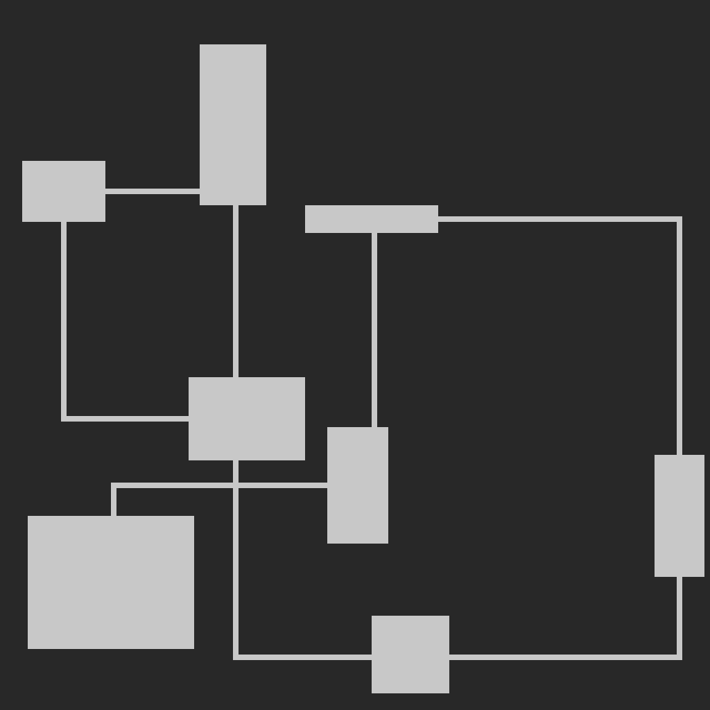

<h1>procedural_dungeon</h1>

A minimal seed-based procedural dungeon generator with a simple CLI.

<h2>Features</h2>
<ul>
    <li>Deterministic dungeon generation utilizing seed</li>
    <li>Optional ASCII visualization in the terminal</li>
    <li>PNG export: <code>output/dungeon.png</code></li>  
</ul>

<h2>Installation</h2>

This program only depends on <strong>Pillow</strong> for PNG output:

<pre><code>pip install Pillow</code></pre>

<h2>Usage</h2>
<ul>
    <li>
Default use scenario:

    <pre><code>python main.py</code></pre></li>
    <li>
Show ASCII output:

    <pre><code>python main.py --ascii</code></pre></li>
    <li>
Use a specific seed:

    <pre><code>python main.py --seed 67</code></pre></li>
</ul>

<h2>License</h2>

MIT License
